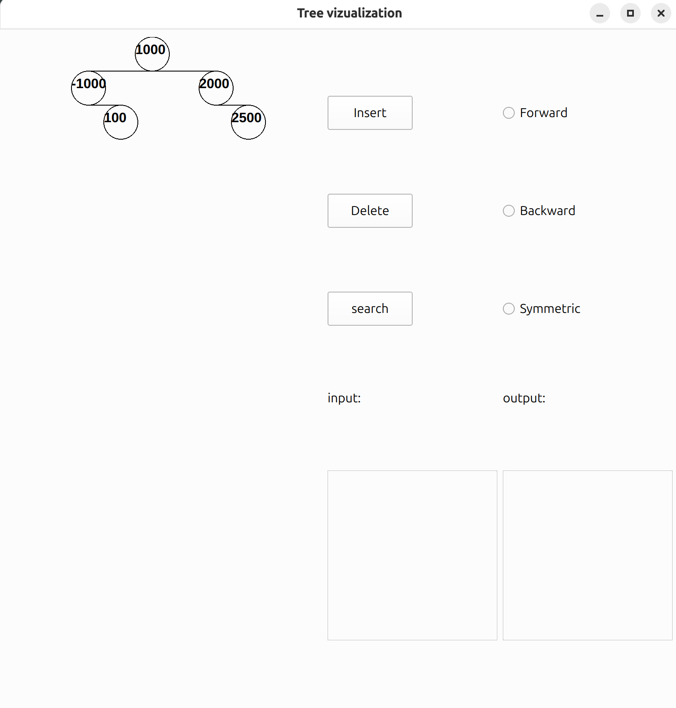

Лабараторная работа 3.

Задачу про смещение я сделал еще на паре, так что скорее всего ее тут нет.

Главная особенность моей лабы - динамическая отрисовка того, какое у вас дерево!

Что представляет из себя программа?

При её запуске вас встречает следующее окно:

Радио кнопки отвечают за то, в каком виде будет осуществляться вывод дерева.
Изначально они пустые, так как я не люблю, когда за пользователя делают выбор
Названия кнопок соответствуют операциям с деревом.
Поля input и output отвечают за вывод.

Пустое поле слева - ваше будущее дерево!

Добавим в наше дерево число, например 1000.

Нажимаем вставить и...

Появляется наше дерево, пока что оно совсем маленькое, всего из одной вершины.
Добавим туда еще чего-то.

Теперь демонстративно удалим число 100.

Перейдем к примерам вывода дерева:

Осталось показать работоспособность поиска:

Такая вот работа вышла